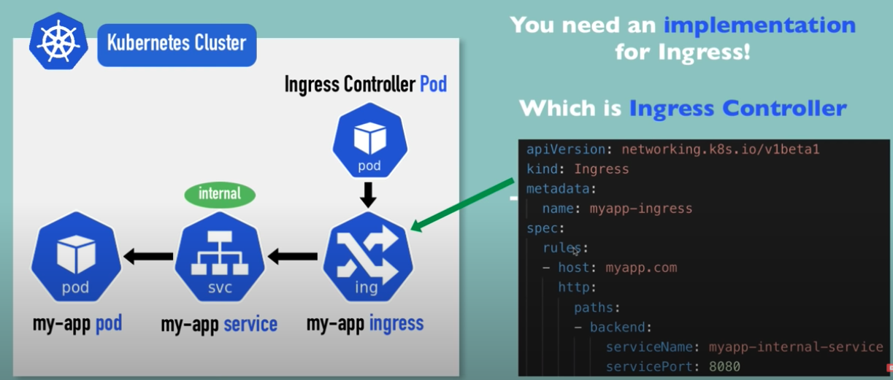

# Ingress Service

From client, request comes first to ingress and then it gets forwarded to the app service (internal).


URL - http://myapp.com/

Map domain name to Node's IP address which is the entrypoint.

We also need an implementation for Ingress which is **Ingress Controller**.

```
apiVersion: networkng.k8s.io/v1beta1
kind: Ingress
metadata:
    name: myapp-ingress
spec:
    rules:
    - host: myapp.com
      http:
        paths:
        - backend:
            serviceName: myapp-internal-service
            servicePort: 8080
```

## Ingress Flow 



## Ingress Controller

1. entrypoint to cluster
2. evaluates all the rules
3. manages redirections
4. Many third-party implementaionts like K8s Nginx Ingress Conroller
5. In case of cloud environemnt, there willbe a **Cloud Load Balancer** that will get the first request and then forwards to the **Ingress Controller**.
6. In case of Bare Metal setup, there will be a **proxy server** (public ip address and open ports) outside kubernetes enviroment which will get the first request and then will forward it to the **Ingress Controller**.

More information => https://kubernetes.io/docs/concepts/services-networking/ingress-controllers/

## To install Ingress Controller in Minikube

```
minikube addons enable ingress
```

## To Enable kubernetes dashboard NS in Minikube
```
$ kubectl apply -f dashboard-ingress.yaml

$ kubectl get ingress -n kubernetes-dashboard --watch
    Name                HOSTS           ADDRESS         PORTS       AGE
    dashboard-ingress   dashboard.com   192.168.64.5    80          42s

vim /etc/hosts
...
192.168.64.5    dashboard.com

:wq
```

## Ingress Default backend

```
kubectl describe ingress dashboard-ingress -n kubernetes-dashboard
```

1. Check for Default backend in the results which is used when the route doesn't exits. By default this displays - 404 Page not found.

2. You can override the default backend service.

```
kubectl descirbe ingress myapp-ingress
```

```
apiVersion: v1
kind: Service
metadata: 
    name: default-http-backend
spec:
    selector:
        app: default-response-app
    ports:
        - protocol: TCP
          port: 80
          targetPort: 8080
```


## Configuring TLS certificate- https://

```
apiVersion: networkng.k8s.io/v1beta1
kind: Ingress
metadata:
    name: tls-example-ingress
spec:
    tla:
    - hosts:
        - myapp.com
        secretName: myapp-secret-tls
    rules:
    - host: myapp.com
      http:
        paths:
        - path: /
        - backend:
            serviceName: myapp-internal-service
            servicePort: 8080
```

```
apiVersion: v1
kind: Secret
metadata:
    name: myapp-secret-tls
    namespace: default
data:
    tls.crt: <base64 encoded cert>
    tls.key: <base64 encoded key>
type: kubernetes.io/tls
```


