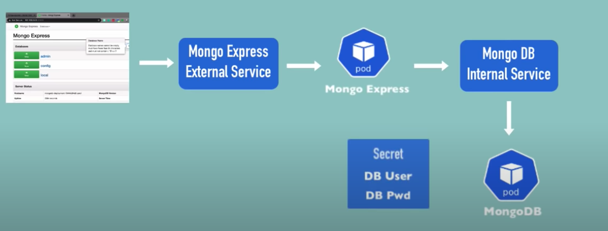

# Project Workflow



```
2 Deployment Pod
2 Service
1 ConfigMap
1 Secret
```

MongoExpress - External Service and Pod

MongoDB - Internal Service and Pod

ConfigMap - DB Url

Secret - DB User and Password

## To make a service External ?

Internal Service or ClusterIP is default.

Use below keyword in the service deployment yaml file. This will assign service an external IP address and so accept external requests.

nodePort must be between 30000-32767. This is the port for external IP address and we need to put this into the browser to access the service.

```
- type: LoadBalancer
- nodeport: 30000
```

## To assign a public ip address to the external service (in minikube)

minikube service mongo-express-service

|-----------|-----------------------|-------------|---------------------------|
| NAMESPACE |         NAME          | TARGET PORT |            URL            |
|-----------|-----------------------|-------------|---------------------------|
| default   | mongo-express-service |        8081 | http://192.168.64.2:30000 |
|-----------|-----------------------|-------------|---------------------------|
🎉  Opening service default/mongo-express-service in default browser...

## All Commands in order

```
kubectl apply -f mongo-secret.yaml
kubectl apply -f mongo.yaml
kubectl apply -f mongo-configmap.yaml 
kubectl apply -f mongo-express.yaml
```

```
kubectl get pod
kubectl get pod --watch
kubectl get pod -o wide
kubectl get service
kubectl get secret
kubectl get all | grep mongodb
```

```
minikube service mongo-express-service
```

## Screenshots


